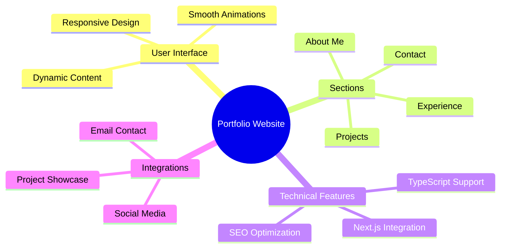
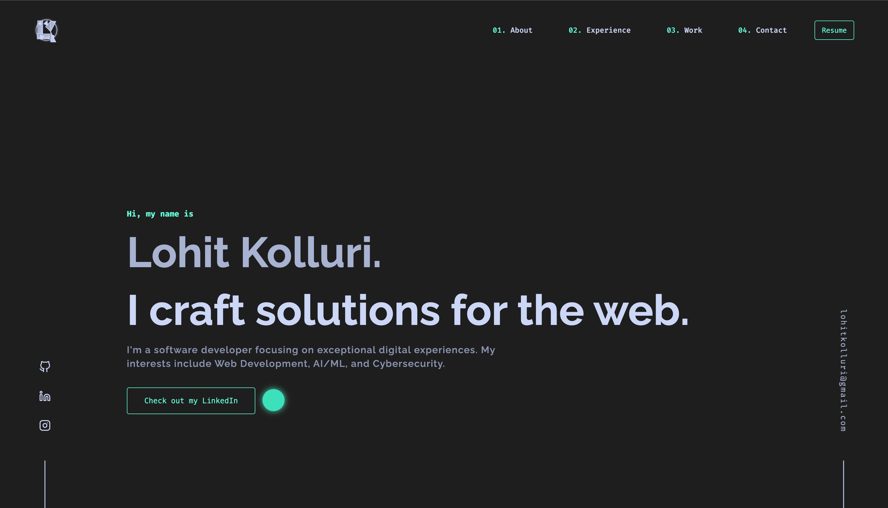

<div align="center">


<p align="center">
  <a href="#features">Features</a> •
  <a href="#demo">Demo</a> •
  <a href="#screenshots">Screenshots</a> •
  <a href="#installation">Installation</a> •
  <a href="#tech-stack">Tech Stack</a>
</p>


[](https://reactjs.org)
[](https://www.typescriptlang.org)

<p align="center">A modern, responsive portfolio website showcasing professional experience, projects, and skills. Built with React, Next.js, and TypeScript, featuring smooth animations and dynamic content. ✨</p>

</div>

## ✨ Features

<div align="center">



</div>

## 🚀 Demo


## 📸 Screenshots

<div align="center">
  
</div>

## 🛠️ Installation


```

2️⃣ Navigate to project directory:
```bash
cd Portfolio
```

3️⃣ Install dependencies:
```bash
npm install
```

4️⃣ Run development server:
```bash
npm run dev
```

5️⃣ Open in browser:
- Visit [http://localhost:3000](http://localhost:3000)

## 💻 Tech Stack

<table align="center">
  <tr>
    <td align="center" width="96">
      
      <br>React
    </td>
    <td align="center" width="96">
      
      <br>Next.js
    </td>
    <td align="center" width="96">
      
      <br>TypeScript
    </td>
    <td align="center" width="96">
      
      <br>SCSS
    </td>
  </tr>
</table>

## ⚡ Core Features

- 📱 Responsive Design
  - Mobile-first approach
  - Seamless experience across all devices
  - Adaptive layouts and components

- 🎯 Dynamic Content
  - Real-time project showcase
  - Interactive experience section
  - Animated skill representations

- 🎨 Modern UI/UX
  - Smooth Framer Motion animations
  - Intuitive navigation
  - Clean and professional design

- 🔍 SEO Optimized
  - Meta tags optimization
  - Semantic HTML structure
  - Performance optimized

## 📄 License

<div align="center">


</div>
